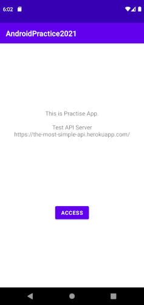
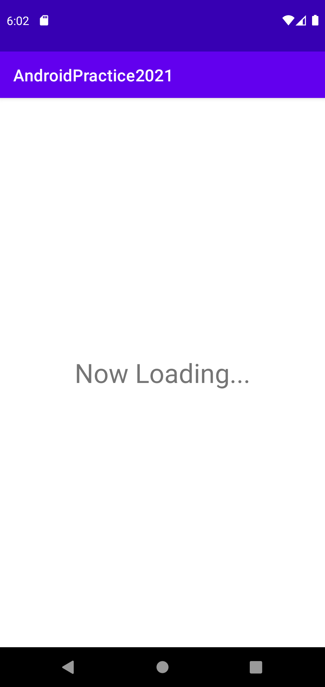
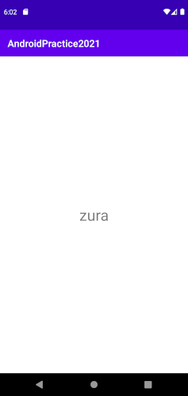

# AndroidPractice2021
デモアプリです。
以下の機能を実装しています。
- ActivityからFragmentの呼び出し
- TextView・Buttonの配置
- FragmentからActivityのIntent
- APIコール
- JSONのパース

# スクリーンショット
## メイン画面

## サブ画面

# APIについて
以下のURLからアクセスできます。
[https://the-most-simple-api.herokuapp.com/](https://the-most-simple-api.herokuapp.com/)

ソースコードは以下です。
[https://github.com/Squ4t4r014/TheMostSimpleAPI](https://github.com/beaconFUN/TheMostSimpleAPI)
